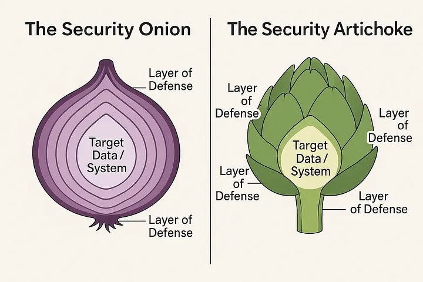

# Principes de sécurité

## Défense en profondeur

Approche qui combine plusieurs couches de protection (techniques, humaines et organisationnelles) pour qu'un seul échec ne compromette pas tout le système.

Avec une légère altération, la pile OSI fournit un bon modèle pour orienter nos réflexions sur les différents niveaux à sécuriser : 

## Principe du moindre privilège

Chaque utilisateur, application ou service ne doit avoir que les droits strictement nécessaires a sa fonction.

**Exemple:** un technicien support peut réinitialiser des mots de passe, mais ne peut pas consulter la base salariale.

## Séparation des responsabilités

Les tâches critiques sont réparties entre plusieurs personnes ou systèmes pour réduire le risque d'abus ou d'erreur.

**Exemple:** la personne qui crée un fournisseur ne peut pas approuver le paiement correspondant.

## Confiance zéro

Ne jamais faire confiance par défaut, même a l'intérieur du réseau; toujours vérifier explicitement l'identité, le contexte et l'état de sécurité.

## Imputabilité et audit

L'imputabilité permet d'attribuer une action a une identité précise; l'audit permet de retracer et analyser les actions pour détecter incidents et non-conformités.

**Exemple:** des journaux centralisés enregistrent qui a accédé a une base de données, quand, et quelle opération a été faite.

Le partage de compte va à l'encontre du principe de l'imputabilité puisqu'il devient difficile de déterminer qui a fait quelle action exactement.